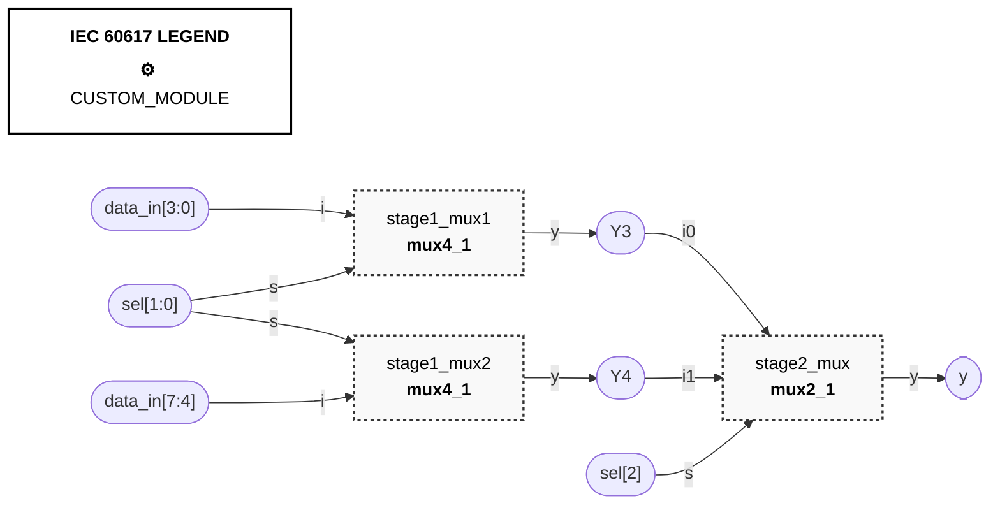

```mermaid
graph LR;
    %% --- COLOR CLASSES ---
    classDef AND_GATE fill:#AEC6CF,stroke:#333,stroke-width:2px,color:#000;
    classDef OR_GATE fill:#77DD77,stroke:#333,stroke-width:2px,color:#000;
    classDef XOR_GATE fill:#CFCFC4,stroke:#333,stroke-width:2px,color:#000;
    classDef NOT_GATE fill:#FDFD96,stroke:#333,stroke-width:2px,color:#000;
    classDef NAND_GATE fill:#FFB347,stroke:#333,stroke-width:2px,color:#000;
    classDef NOR_GATE fill:#FF6961,stroke:#333,stroke-width:2px,color:#000;
    classDef MUX2X1 fill:#B39EB5,stroke:#333,stroke-width:2px,color:#000;
    classDef CUSTOM_MODULE fill:#8EE1E7,stroke:#333,stroke-width:2px,color:#000;
    classDef DEFAULT_MOD fill:#f9f9f9,stroke:#333,stroke-width:2px,stroke-dasharray: 3 3,color:#000;

    LEGEND["<h4 style='margin:0px; padding-bottom:5px; color:black !important;'>IEC 60617 LEGEND</h4><div style='margin-bottom:4px; color:black !important;'><span style='display:inline-block; border:1px dashed #333; background:#f9f9f9; padding:2px 8px; border-radius:3px; width:35px; text-align:center;'><b style='color:black !important;'>⚙️</b></span> CUSTOM_MODULE</div>"]
    style LEGEND fill:#ffffff,stroke:#000,stroke-width:2px
    %% ----------------------------------

    stage1_mux1["stage1_mux1<br><b>mux4_1</b>"]:::DEFAULT_MOD
    data_in_3_0_(["data_in[3:0]"]) -->|i| stage1_mux1;
    sel_1_0_(["sel[1:0]"]) -->|s| stage1_mux1;
    stage1_mux1 -->|y| Y3(["Y3"]);
    stage1_mux2["stage1_mux2<br><b>mux4_1</b>"]:::DEFAULT_MOD
    data_in_7_4_(["data_in[7:4]"]) -->|i| stage1_mux2;
    sel_1_0_(["sel[1:0]"]) -->|s| stage1_mux2;
    stage1_mux2 -->|y| Y4(["Y4"]);
    stage2_mux["stage2_mux<br><b>mux2_1</b>"]:::DEFAULT_MOD
    Y3(["Y3"]) -->|i0| stage2_mux;
    Y4(["Y4"]) -->|i1| stage2_mux;
    sel_2_(["sel[2]"]) -->|s| stage2_mux;
    stage2_mux -->|y| y(["y"]);
```
