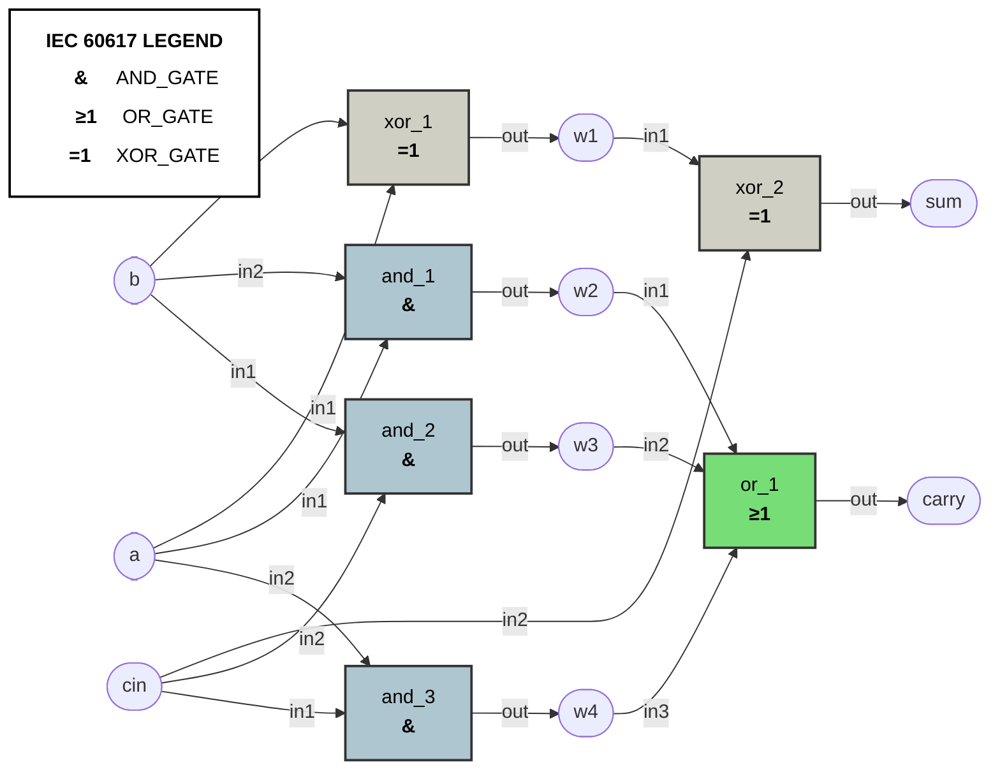

# My Capstone Hardware Project

Here is the automated architecture diagram of my top-level module(s):
### 📄 Architecture: `full_adder.v`

## Project Details
Write your normal documentation down here.